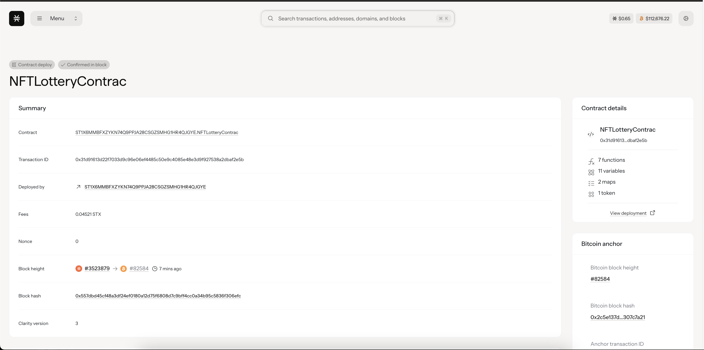

# NFT Lottery Contract

## Project Description

The NFT Lottery Contract is a decentralized lottery system built on the Stacks blockchain using Clarity smart contracts. Participants can enter lottery rounds by paying an entry fee in STX, and winners are randomly selected to receive unique NFTs. This creates an engaging gamification mechanism that combines the excitement of lottery systems with the collectible value of Non-Fungible Tokens.

The contract implements a fair and transparent lottery mechanism where:
- Users pay an entry fee to participate in lottery rounds
- Winners are selected using pseudo-random number generation based on blockchain data
- Each winner receives a unique NFT as their prize
- The lottery operates in rounds, allowing for multiple draws over time

## Project Vision

Our vision is to revolutionize traditional lottery systems by leveraging blockchain technology to create:

- **Transparency**: All lottery operations are recorded on-chain and publicly verifiable
- **Decentralization**: No central authority controls the lottery outcomes
- **Digital Collectibles**: Winners receive valuable NFTs instead of traditional monetary prizes
- **Community Engagement**: Building a vibrant community of collectors and lottery enthusiasts
- **Fair Gaming**: Cryptographically secure random number generation ensures fair winner selection

We envision this platform becoming a cornerstone for blockchain-based gaming and collectible ecosystems, where users can participate in exciting lottery events while building their digital asset portfolios.

## Future Scope

The NFT Lottery Contract has extensive potential for expansion and enhancement:

### Phase 1 - Core Enhancements
- **Multiple NFT Tiers**: Implement rare, common, and legendary NFT categories with different probabilities
- **Batch Drawings**: Allow multiple winners per round with different NFT rarities
- **Metadata Integration**: Add rich metadata to NFTs including images, attributes, and rarity scores
- **Prize Pool Accumulation**: Implement progressive jackpots that grow over multiple rounds

### Phase 2 - Advanced Features
- **Multi-Token Support**: Accept different cryptocurrencies as entry fees
- **Staking Mechanisms**: Allow NFT holders to stake their tokens for additional lottery entries
- **Secondary Marketplace**: Build integrated trading functionality for won NFTs
- **Referral Systems**: Reward users for bringing new participants to the lottery

### Phase 3 - Ecosystem Integration
- **Cross-Chain Compatibility**: Expand to other blockchain networks
- **DAO Governance**: Allow NFT holders to vote on lottery parameters and new features
- **Gaming Integration**: Incorporate lottery NFTs into blockchain games and metaverse platforms
- **DeFi Yield Farming**: Use lottery proceeds for yield generation and additional prize distribution

### Phase 4 - Enterprise Solutions
- **White-label Platform**: Offer lottery-as-a-service for other projects
- **Analytics Dashboard**: Comprehensive statistics and insights for participants
- **Mobile Application**: Native mobile app for easy participation
- **API Integration**: Allow third-party applications to integrate lottery functionality

## Contract Address Details

*Contract address information will be added upon deployment*

### Mainnet Deployment
- **Contract Address**: `[To be added]`
- **Deployment Block**: `[To be added]`
- **Contract Version**: `v1.0.0`

### Testnet Deployment
- **Contract Address**: `[To be added]`
- **Deployment Block**: `[To be added]`
- **Network**: Stacks Testnet

### Contract Functions

#### Public Functions
1. **enter-lottery()**: Allows users to participate in the current lottery round
2. **draw-winner()**: Randomly selects and rewards a winner (owner only)

#### Read-Only Functions
- `get-lottery-info()`: Returns current lottery status and parameters
- `get-participants(round)`: Lists all participants for a specific round
- `has-user-entered(user)`: Checks if a user has entered the current round

#### Owner Functions
- `toggle-lottery()`: Start or stop the lottery
- `set-entry-fee(amount)`: Update the entry fee for participation

### Getting Started

1. **For Participants**:
   - Ensure you have STX tokens in your wallet
   - Call `enter-lottery()` to participate in the current round
   - Wait for the round to end and winner announcement
   - If you win, the NFT will be automatically minted to your address

2. **For Contract Owners**:
   - Deploy the contract to the Stacks blockchain
   - Use `toggle-lottery()` to start the first round
   - Call `draw-winner()` to conclude rounds and select winners
   - Monitor participant activity using read-only functions

### Security Features

- **Owner-only Controls**: Critical functions are restricted to contract owner
- **Duplicate Entry Prevention**: Users cannot enter the same round multiple times
- **Balance Verification**: Ensures sufficient STX balance before entry
- **Pseudo-random Generation**: Uses blockchain VRF for fair winner selection

###Contract address detail

---

*This project is open-source and welcomes community contributions. For questions, suggestions, or collaboration opportunities, please reach out through our official channels.*
